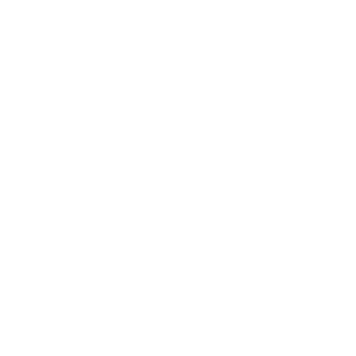

	
  <h1>Car-Urus</h1>

Car-Urus is a car rental website that allows users to rent out cars of their choosing. There are many functionalities such as:
- Picking location
- pick up dates & drop off dates
- pick up time & drop off time
- filter types of cars

## Tools used:

ReactJs(useState & useEffect)
ReduxToolkit
React Router Dom

## To run this website locally:

Clone the repository Install dependencies by running npm install in the project directory Start the server by running npm run server in the project directory Start the client by running npm run client in a new terminal window Open http://localhost:3000 with your browser to see the result.
